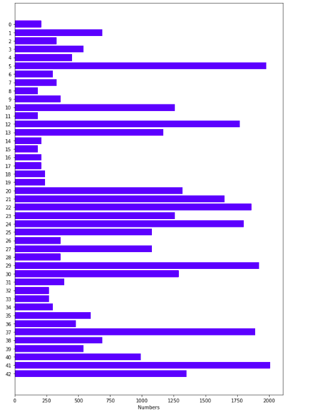
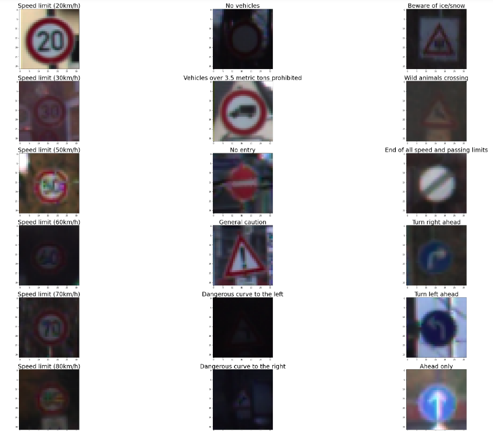
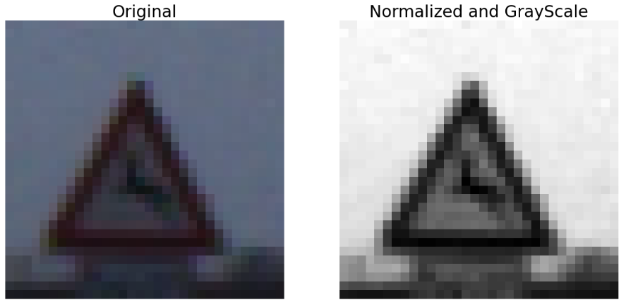
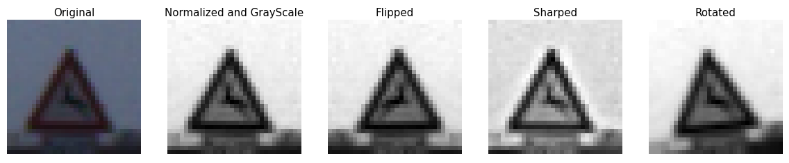
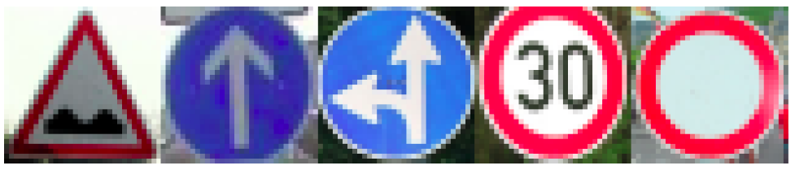
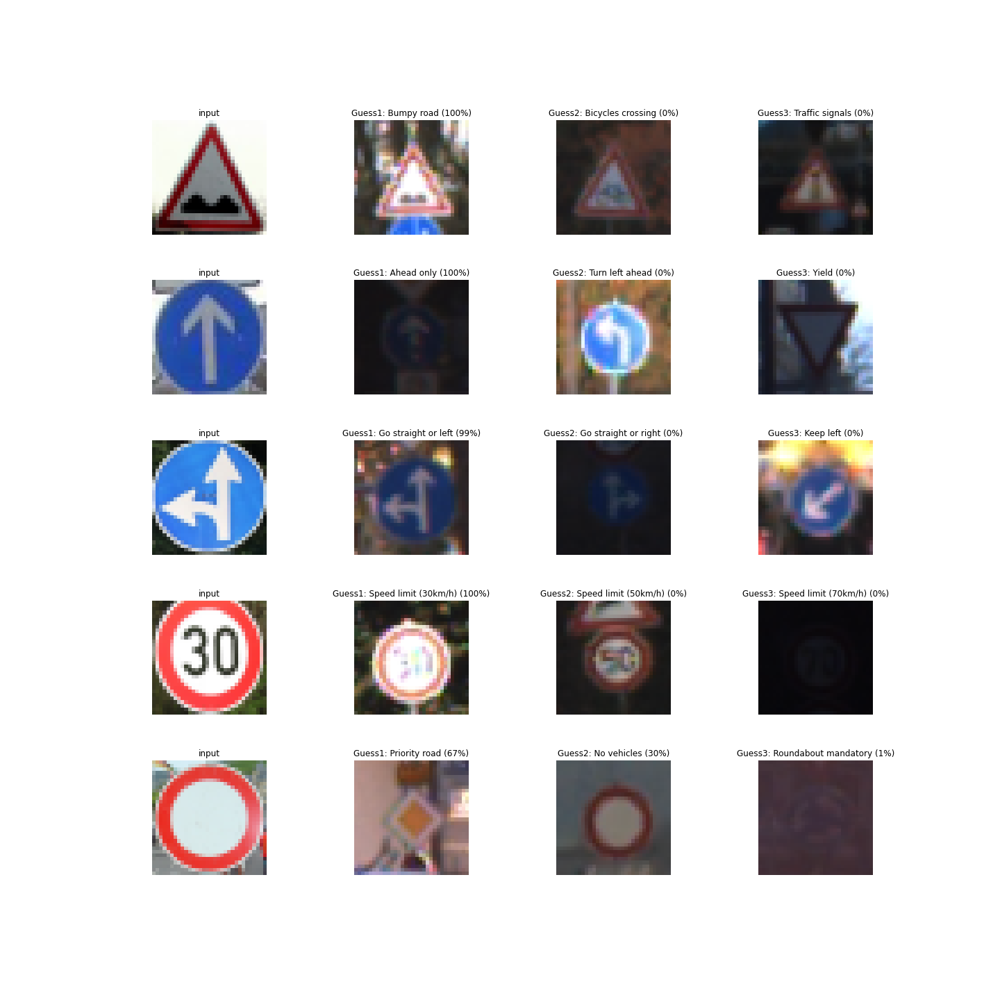

# **Traffic Sign Recognition** 

## Writeup

In this project the main purpose is creating a classifier to detec traffic signs.
---

The steps of this project are the following:
* Load the data set 
* Explore, summarize and visualize the data set
* Design, train and test a model architecture
* Use the model to make predictions on new images
* Analyze the softmax probabilities of the new images
* Summarize the results with a written report

---

####  Data Set Summary & Exploration
The size of the dataset(train, test,valid) is as follows:
* Training set : 139196
* Validation set : 17640
* Test set : 50520

The shape of the traffic signs images is 32x32x1. There is 43 classes into datasets. I used the pandas library to calculate summary statistics of the traffic signs data set. The distribution of the images according to the classes is shown in below. 

  

Some of the images in the dataset can be seen as following: 

### Model Architecture Design and Test 

#### Pre-processig the image 
As a first step, I decided to convert the images to grayscale and normalized in order to increase accuracy. When the images become grayscale and normalized it is easier to train them. 
Here is an example of a traffic sign image before and after grayscaling.

I generated additional data with using some preprocessing steps. These steps are 
- sharping the image, 
- flipping the image,
- rotating the image. 
Some samples of pre-processed images can be seen as following:

#### Model architecture 
I have modified the original LeNet architecture. I have added 1 conv layer and 1 fully conv layer to the original LeNet model.

My final model consisted of the following layers:
| Layer         		|     Description	        					| 
|:---------------------:|:---------------------------------------------:| 
| Input         		| 32x32x3 RGB image   							| 
| Convolution 5x5     	| 1x1 stride, valid padding, outputs 28x28x6 	|
| RELU					|												|
| Max pooling	      	| 2x2 stride,  outputs 14x14x6 				|
| Convolution 5x5	    | 1x1 stride, valid padding, outputs 10x10x16					|
| RELU					|												|
| Max pooling	      	| 2x2 stride,  outputs 5x5x16 				|
| Convolution 5x5	    | 1x1 stride, valid padding, outputs 3x3x32					|
| RELU					|												|
| Fully connected		| Input:288 Output:100        									|
| RELU					|												|
| Dropout					|			keep prob:1									|
| Fully connected		| Input:180 Output:120        									|
| RELU					|												|
| Dropout					|			keep prob:1									|
| Fully connected		| Input:120 Output:84        									|
| RELU					|												|
| Dropout					|			keep prob:1									|
| Fully connected		| Input:84 Output:43        									|

#### Training 
To train the model, I used following parameters:

* The learning rate: 0.001
* The EPOCHS: 50
* The BATCH SIZE: 128

#### Results

My final model results were:
* training set accuracy of **%99.3**
* validation set accuracy of **%94.3**
* test set accuracy of **%92.3**

In iterative process, I firstly used LeNet, however, model is getting overfitting. Then i added some layers. Also, I have tuned  number of images in dataset, learning rate, batch size and epoch. I obtained parameters at above.
 

### Test a Model on New Images

I have found 5 images from the web,which can be seen at below.And the testing accuracy is 80% for those images (shown below):

#### Predictions

My Data Set Accuracy = 0.800
The resulted labels are: 
['Bumpy road', 'Ahead only', 'Go straight or left', 'Speed limit (30km/h)', 'Priority road']

#### Softmax probabilities for each prediction.

Instead of table I used figures to represent softmax probabilities for each test images
Here results:

